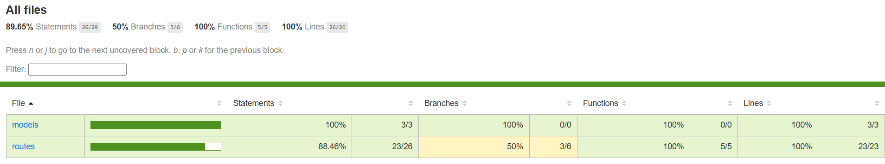
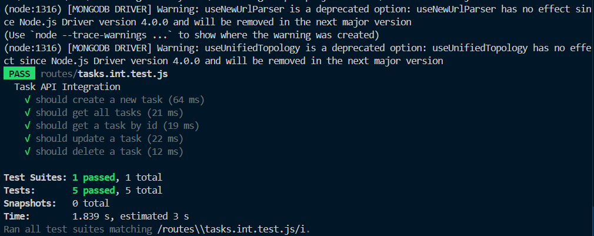
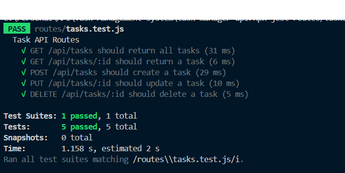

# Task Management API

A simple RESTful API for managing tasks, built with Node.js, Express, and MongoDB. The API supports CRUD operations (Create, Read, Update, Delete) for tasks, each with a title, description, status, and due date.

## API Overview
- **Base URL:** `/api/tasks`
- **Endpoints:**
  - `GET /api/tasks` — List all tasks
  - `GET /api/tasks/:id` — Get a single task by ID
  - `POST /api/tasks` — Create a new task
  - `PUT /api/tasks/:id` — Update a task by ID
  - `DELETE /api/tasks/:id` — Delete a task by ID

## Tech Stack
- **Node.js**
- **Express**
- **MongoDB** (with Mongoose)
- **Jest** (testing framework)
- **Supertest** (API testing)
- **mongodb-memory-server** (in-memory MongoDB for integration tests)

## Setup & Running
1. **Install dependencies:**
   ```bash
   npm install
   ```
2. **Set up environment variables:**
   - Create a `.env` file with your `MONGO_URI` and (optionally) `PORT`.
3. **Start the server:**
   ```bash
   node server.js
   ```

## Running Tests
To run all unit, integration, and API tests with coverage:
```bash
npm test
```
- This will run all Jest tests and display code coverage information.
- Integration tests use an in-memory MongoDB, so no real data is affected.

## Unit Test Coverage
Below is a screenshot of the current test coverage:



## Integration Test Screenshot
Below is a screenshot of the integration test results:



## API Test Screenshot
Below is a screenshot of the API test results:



## Testing Tools Used
- **Jest** — Unit, integration, and API testing
- **Supertest** — HTTP assertions for API endpoints
- **mongodb-memory-server** — In-memory MongoDB for safe, fast integration tests

# Task Management System API

A simple RESTful API for managing tasks, built with Node.js, Express, and MongoDB.

---

## API Endpoints

All endpoints are prefixed with `/api/tasks`.

| Method | Endpoint           | Description                        | Request Body (JSON)                | Response Example |
|--------|--------------------|------------------------------------|------------------------------------|-----------------|
| GET    | `/api/tasks`       | Get all tasks                      | -                                  | `[{"_id": "...", "title": "...", ...}]` |
| GET    | `/api/tasks/:id`   | Get a single task by ID            | -                                  | `{"_id": "...", "title": "...", ...}`   |
| POST   | `/api/tasks`       | Create a new task                  | `{ "title": "Task", "description": "...", "status": "pending", "dueDate": "2024-06-01" }` | `{"_id": "...", "title": "...", ...}`   |
| PUT    | `/api/tasks/:id`   | Update a task by ID                | `{ "title": "Updated", ... }`      | `{"_id": "...", "title": "...", ...}`   |
| DELETE | `/api/tasks/:id`   | Delete a task by ID                | -                                  | `"Task deleted successfully"`           |

### Task Object Structure

```json
{
  "_id": "string",
  "title": "string",
  "description": "string",
  "status": "pending | completed",
  "dueDate": "ISODate string",
  "createdAt": "ISODate string",
  "updatedAt": "ISODate string"
}
```

---

## Database

- **Type:** MongoDB
- **Integration:** Uses [Mongoose](https://mongoosejs.com/) for schema modeling and database operations.
- **Schema:**
  - `title` (String, required)
  - `description` (String, optional)
  - `status` (String, enum: `pending`, `completed`, default: `pending`)
  - `dueDate` (Date, optional)
  - Timestamps for creation and update

**Connection:**  
The server connects to MongoDB using the `MONGO_URI` environment variable (set in a `.env` file).

---

## How to Run the Server

1. **Install dependencies:**
   ```bash
   npm install
   ```

2. **Set up environment variables:**  
   Create a `.env` file in the root directory with:
   ```
   MONGO_URI=your_mongodb_connection_string
   ```

3. **Start the server:**
   ```bash
   node server.js
   ```
   The server will run on `http://localhost:5000` by default.

---

## How to Run the Frontend Locally (Optional)

The frontend is a static HTML file located at `public/index.html`.  
When the server is running, visit [http://localhost:5000/](http://localhost:5000/) in your browser.

---

## How to Interact with the API

You can use tools like [Postman](https://www.postman.com/) or [curl](https://curl.se/) to interact with the API.

### Example: Create a Task

```bash
curl -X POST http://localhost:5000/api/tasks \
  -H "Content-Type: application/json" \
  -d '{"title":"Buy groceries","description":"Milk, Bread, Eggs","dueDate":"2024-06-01"}'
```

### Example: Get All Tasks

```bash
curl http://localhost:5000/api/tasks
```

### Example: Update a Task

```bash
curl -X PUT http://localhost:5000/api/tasks/<TASK_ID> \
  -H "Content-Type: application/json" \
  -d '{"status":"completed"}'
```

### Example: Delete a Task

```bash
curl -X DELETE http://localhost:5000/api/tasks/<TASK_ID>
```

---

## Running Tests

To run the unit and integration tests, use:

```
npm test
```

This will run all Jest tests and display code coverage information.
